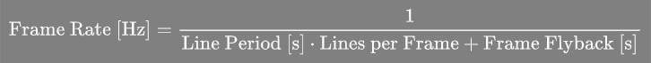
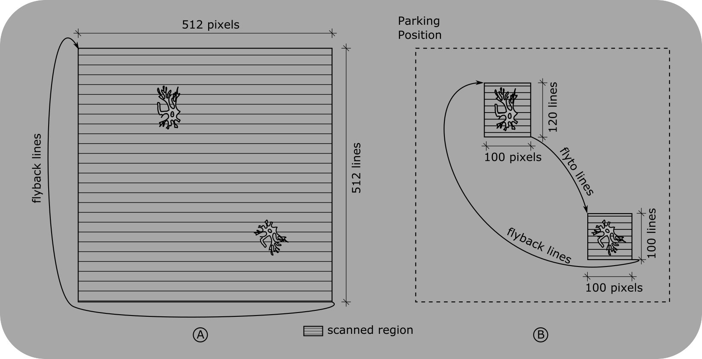
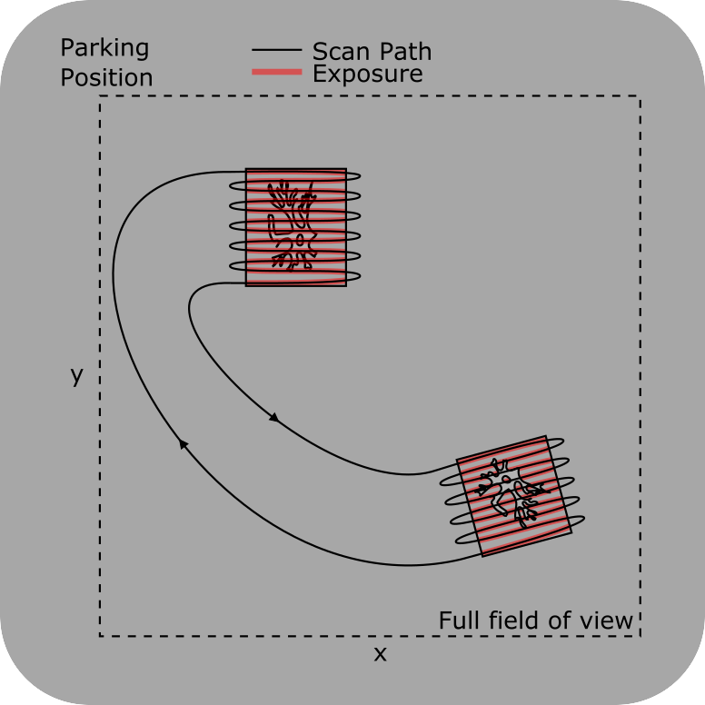
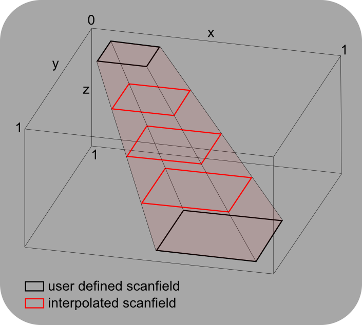
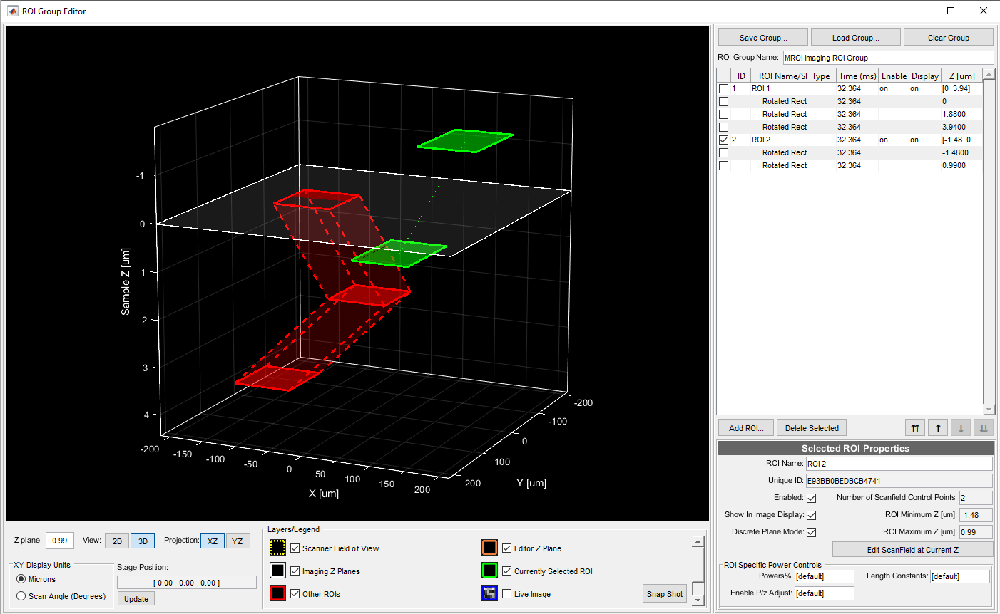
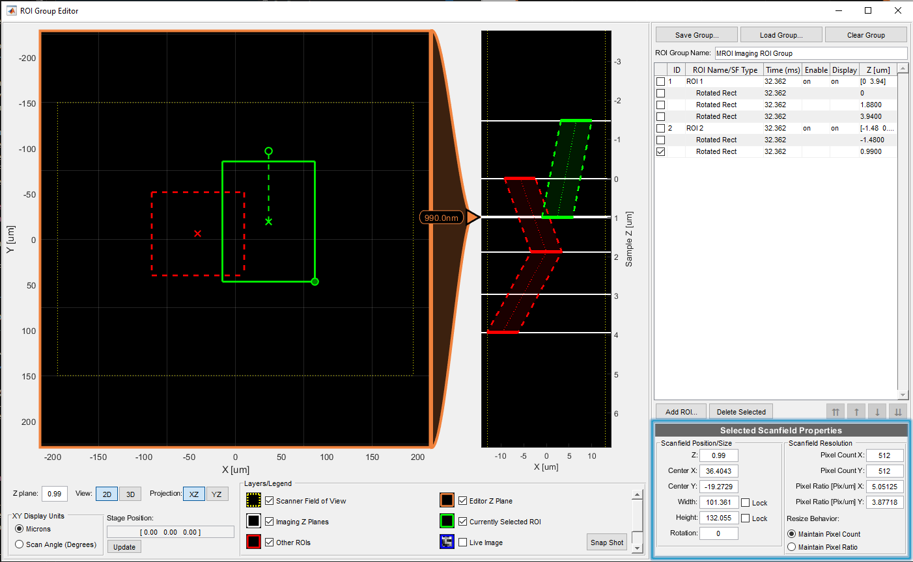

Multiple Region of Interest (MROI) Imaging in ScanImage®
========================================================

ScanImage® allows the full field of view of the microscope to be subdivided into multiple regions of interest (ROIs).

Benefits
--------

The use of ROIs offers the following advantages:

1. Frame Rate Optimization
2. Limiting tissue exposure
3. Tracing features through a volume

Frame Rate Optimization
-----------------------

In a laser scanning microscope scanning a single large range within the field of view, the frame rate is calculated as follows:

To increase the frame rate, several adjustments can be made:

- Increase the line rate through faster resonant scanning or linear scanning adjustments.
- Decrease the number of lines per frame.
- Decrease the frame flyback time.

Scanning a single large region at a higher frame rate can lead to lower image resolution in areas that may only contain a few smaller regions of interest. Multiple ROI scanning allows for optimization of the frame period by skipping regions of low interest while preserving image resolution within the ROIs.

Limiting Tissue Exposure
------------------------

ScanImage® minimizes tissue exposure by fully attenuating the beam power while traversing between ROIs. It also allows setting different beam powers for each ROI to adjust for sensitivity.

Tracing Features Through a Volume
----------------------------------

A ScanImage® volume comprises multiple image planes at different z-planes. With the MROI feature, users can define 'scanfields' at various cross-sections, allowing for tracing features through a volume.

Using MROI
----------

ScanImage determines scan paths and timing from ROI data, primarily configured through the ROI Group Editor. Each ROI is a collection of scanfields, with properties that shape the overall ROI.

Configure ROIs Acquisition Parameters
-------------------------------------

To specify scanfield properties precisely, such as width, height, center position, rotation, and pixel resolution, users can edit the corresponding fields in the Selected Scanfield Properties section of the ROI Group Editor.

ROIs can be configured with names, enable states, display preferences, and discrete plane modes. They can also have ROI-specific power controls for a unique beam power vs. depth relationship per ROI.

Output File
-----------

The output of an MROI acquisition is a TIFF file with metadata for each ROI. The images for each ROI's plane are stacked seamlessly in the image file.

For detailed TIFF specifications, see the ScanImage® BigTiff Specification.

